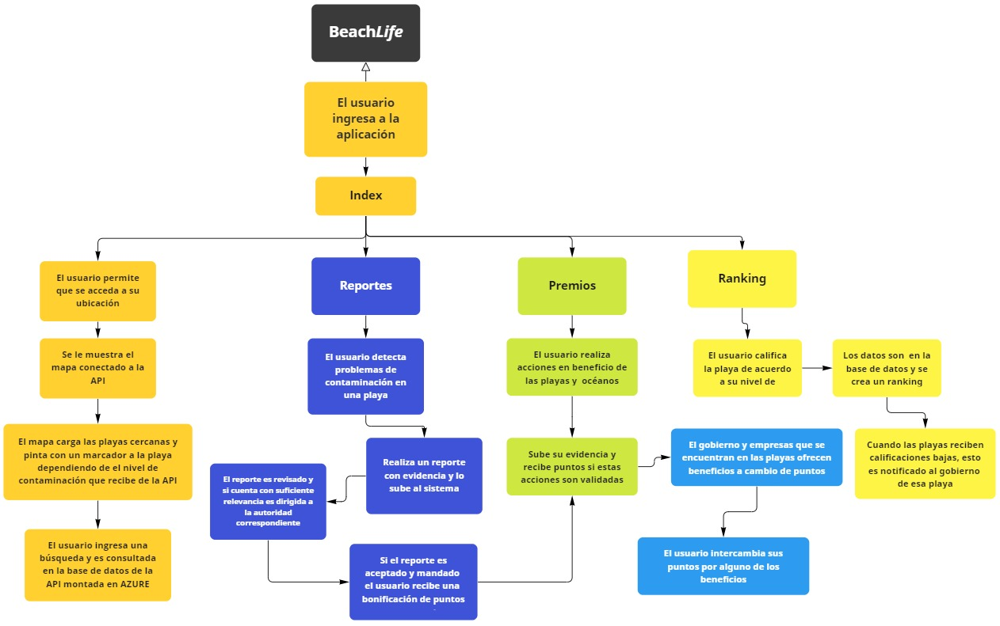
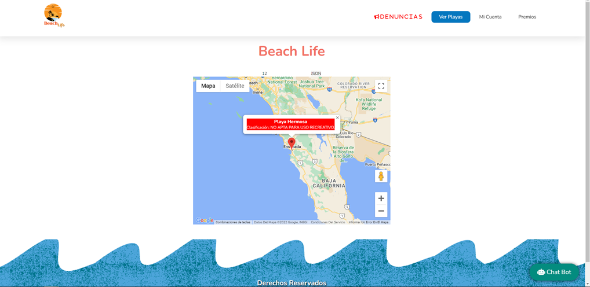
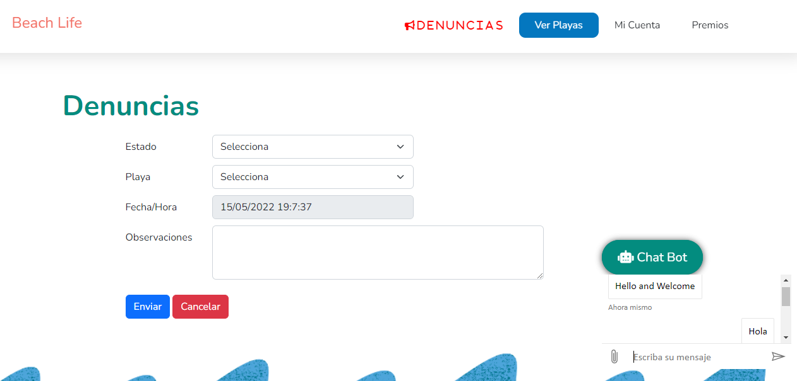
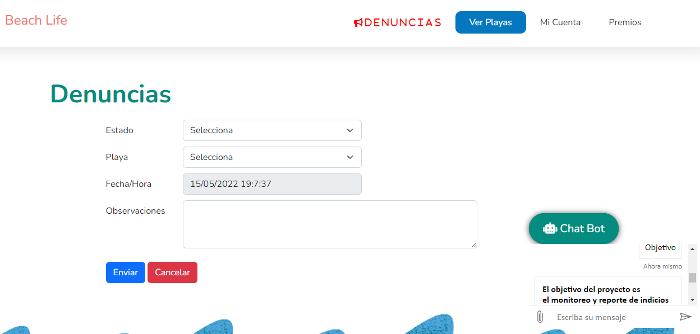

# Beach*Life*  V.1.0

## Enlace de despliegue

[Soy el enlace del despliegue](https://mafernandalopez.github.io/HackOcean/index.html)

## ¿Qué es Beach*Life*?

Beach*Life* es una Aplicación Web que busca mostrar a turistas, habitantes y Autoridades Locales pertenecientes a Estados de la República Méxicana el status actual en la que se encuentran las playas en materia de contaminación por medio una API realizada por Beach*Life, y* un semáforo que mostrará de acuerdo a los datos que publica COFEPRIS si son aptas para uso  recreativo o no. Además los usuarios de la aplicación pueden calificar el estado de la playa con Puntuaciones del 1 al 5 para compartir con otros usuarios su experiencia y eatado ambiental de la playa en donde se localicen.

Los usuarios tambíen podran realizar Reportes/Denuncias sobre situaciones de contaminación que detecten, estos reportes serán procesados y validados para porteriormente ser enviados a las autoridades correspondientes. Además posteriormete los usuarios podrán obtener recompensas a cambio de sus contribuciónes a la limpieza de playas, campañas de concientización y acciones que conlleven a la preservación de las playas mexicanas.

## Diagrama de Solución

## ¿Cómo se visualiza el estado de contaminación de las playas?

La aplicación por medio de la ubicación del usuario y una API realizada por el equipo de BeachLife, mostrará al usuario un mapa con marcadores dependiendo el color (Verde, Amarillo o Rojo)  se representa el grado de contaminación de acuerdo a los esterococos encontrados por cada 100 mlilitros.

Para fines de información los colores representan lo siguiente:

* Verde: 0 a 100npm /100ml APTA PARA USO RECREATIVO
* Amarillo: entre 100 y 150 npm /100ml APTA PARA USO RECREATIVO CON PRECAUCIÓN
* Rojo mas de 150 npm /100ml NO APTA PARA USO RECREATIVO

*(Servicio ejecutado de forma local)*

## ¿Para qué sirven los Reportes/Denucias?

Los reportes realizados por los usuarios tienen la finalidad de recabar problemas de contaminación que sean detetados en las areas donde se encuentren, al realizar un reporte este será analizado para ver su relevancia y porteriormente hacerle llegar a las autoridades correspodientes, al realizar reportes afectará la calificación de la playa, por lo que las autoridades tendrán un punto que deben cubrir si sus playas reciben malas puntuaciones.

Por el momento se implementó un formularaio y el mapa consumiendo el servicio de la API realizada para que en base al estado y playa seleccionada para levantar el reporte se muestre el semáforo al usuario.

## ¿Cómo funciona el sistema de puntos?

Sabemos que es dificil generar conciencia sobre el cuidado de las playas y los oceanos, es por ello que en actualizaciónes posteriores   se busca lograr una colaboracón con las autoridades, dueños de pequeñas, medianas y grandes empresas como Restuarantes, Prestadores de Servicios Turísticos y Hoteles para que brinden premios a los usuarios que por medio de la aplicacón suban pruebas de actividades que beneficien a la conservación de las playas y oceanos.

Cada actividad que los usuarios les generará puntos acumulables, los cuales podrán intercambiar por algún beneficio que ofrezcan los establecimientos antes mencionados (el costo de puntos de los premios será acordado por el establecimiento ).

Las actividades para generar puntos pueden ser las siguentes:

* Limpieza de un área determinada de la playa
* Campañas de concientización
* Participación en talleres
* Realizar reportes

Para poder obtener puntos se necesita poner las manos a la bra es por ello que se debe realizar al menos 2 actividades validadas por cada reporte para que este pueda ser considerdo para la obtención de puntos.

## Progreso de la versión actual

La aplicación se encuentra en fase de desarrollo, por lo que se pensó en la infraestructura en AZURE lo cual está al 90% y en el Front se realizó el maquetado pero aún no se realiza la integración de puntos por lo que esto esta en desarrollo.

 A continuación se presenta una lista de lso puntos que contiene el proyecto final marcando con ✔️ los cumplidos y con una ❌ los que aún están en fase de desarrollo

* Creación de la API para brindar los datos que publica COFEPRIS (Los datos de COFEPRIS se publican en archivos PDF por lo que no es posible consumirlos, es por ello que se está ceando esta API para poder consumir los datos) ✔️
* Creación del Formulario de Reportes ✔️ (Se tiene una primer versión en maquetación y se esta trabajando con Java y Spring)
* Uso de la API de Google Maps para mostrar el Mapa con la ubicación del usuario ✔️
* Visualizacíon de las playas con marcadores de colores del semaforo ✔️
* Implementación del sistema de recompensas ❌
* Implentación del sistema de calificación de las playas por parte de los usuarios ✔️
* Implementación de un Chat Bot ✔️

*Nota: Hasta que se consiga implementar el sistema de recompenzas los usuarios podrán crear una cuenta para poder almacenar los datos, de momento se cuenta solo con el formulario para generar los reportes.*

## Soy empresario, ¿Por qúe deberia aportar a este proyecto?

Las empresas, ya sean grandes, medianas o pequeñas son fundamentales en la lucha por cuidar el mundo y hacerlo más sostenible ya que afectan de forma directa en la gestión del medio ambiente. Asimismo, es una oportunidad para la innovación y crecimiento. Como establecimientos que se benefician del sector turístico en las playas es importante que aporten al cuidado del lugar donde trabajan y este  proyecto es una gran oportunidad para ser reconocidos como empresas comprometidas con el medio ambiente.

## Chat-Bot - CREACIÓN

Se creo el Chat-Bot mediante Azure

Contiene un asistenten virtual llamado Chat-Bot, el cual ayuda a los usuarios en cuestiones de uso de la aplicación mediante palabras clave.
La palabra para inicializar el Chat-Bot es "Hola".

Un ejemplo de ello, te proporciona el Objetivo del proyecto al escribirle Objetivo.

*Nota: debido al costo de mantener funcioando al Chat Bot solo se activó para realizar las pruebas*

## Sistema de geolocalización con Base de datos en Azure

## API playas de México

En México contamos con 11,122km de longitud de costa, en el cual algunos organismos del Estado Mexicano realizan pruebas para medir la contaminación en las playas, esta información se difunde en imágenes o archivos PDF en los sitios oficiales de gobierno, y es utilizado en su mayoría por medios de comunicación y algunos turistas para considerar antes de realizar algún viaje.

Repositorio de la API --> https://github.com/jivancm/playas-mex-api

Esta API tiene la intención de ser una fuente de información que permita a diferentes sectores de la sociedad obtener la información de una manera más digerible.

Se cuenta con un padrón de 387 playas ubicadas 76 municipios de 19 entidades de la república.

stos son las rutas que están disponibles para ser consumidas:

Playas
https://apiplayasmx.herokuapp.com/playas

En esta ruta se devuelve un JSON con la siguiente estructura:
[ { "id": 1, "nombrePlaya": "Playta de Rosarito", "latitud":32.33555556, "longitud":-117.0577778 }, ... ]

Municipios y estados
https://apiplayasmx.herokuapp.com/municipios
https://apiplayasmx.herokuapp.com/estados
La idea de estos endpoints es la de devolver las playas que se encuentran en esos lugares.

Clasificación
https://apiplayasmx.herokuapp.com/clasificaciones

Es la calificación o evaluación obtenida por COFEPRIS o SEMARNAT, y que está publicada en diferentes sitios de gobierno.

[ { "id":1, "nombreClasificacion":"APTA", "npm":150, "fechaActualizada":"2022-03-17", "idPlaya":{ "id":1, "nombrePlaya":"Playa de Rosarito", "latitud":32.33555556, "longitud":-117.0577778 } }, ... ]

## Miembros del equipo:

Dudas o aclaraciones sobre el proyecto no dude en consultar a alguno de los miembros de equipo de trabajo: 

**Lider:** Nóe Gustavo Calalpa  launchx00603@innovaccion.mx

José Iván Carranza launchx01934@innovaccion.mx

Maria Fernanda López Zárate launchx00805@innovaccion.mx

David Merino Pérez launchx06140@innovaccion.mx

Abel Ramesess Castillo launchx02121@innovaccion.mx
